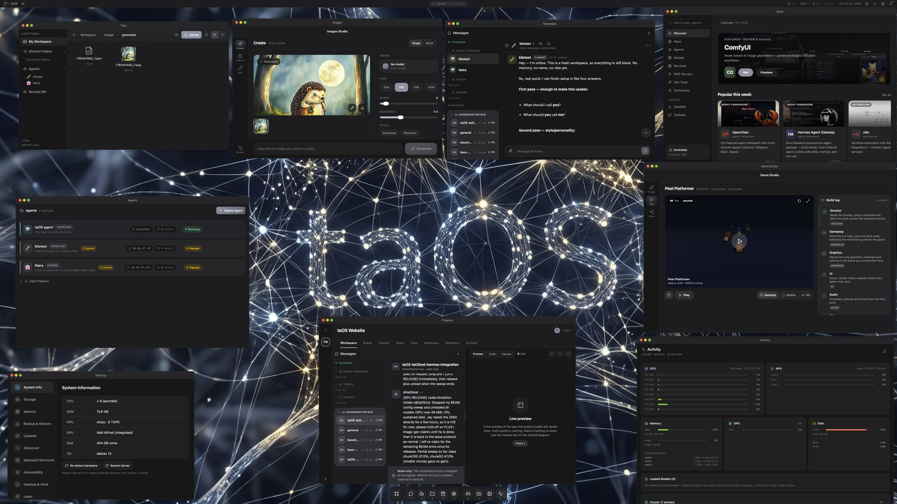
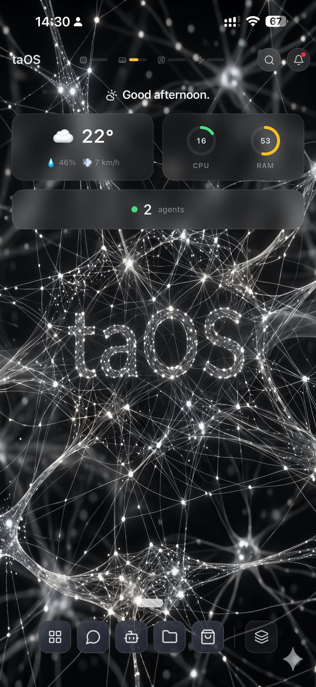

<p align="center">
  
</p>

# taOS

> **⚠️ Pre-beta — GUI not yet fully wired to core functions.** The install script works and the backend, API, memory system (taOSmd), and multi-framework group chat are functional. Six agent frameworks are verified in group chat end-to-end: OpenClaw, Hermes, SmolAgents, Langroid, PocketFlow, and OpenAI Agents SDK — agents running on different frameworks can talk to each other in a shared channel. The desktop GUI is still being wired up for the long tail of app interactions (some agent management flows, worker connections, model routing) — expect rough edges for another week. **First beta expected the week of Monday 20 April.** Star/watch the repo to be notified when it drops.

Self-hosted AI agent platform that runs on whatever hardware you have. An old laptop, a Raspberry Pi, a gaming PC, an SBC gathering dust, or all of them at once. TinyAgentOS turns your spare hardware into a distributed AI compute cluster.

A full web desktop environment with 34 bundled apps, 87 catalog apps, 43 MCP plugins, 15 agent frameworks, a curated local model catalog of 97 manifests covering LLMs, vision, embeddings, audio, and image generation (including RK3588 NPU variants via c01zaut/happyme531), plus 167k+ searchable models from HuggingFace, agent deployment, training, image/video/audio generation, and full system monitoring, all from a single web dashboard. Supports Apple Silicon (MLX), NVIDIA, AMD, Rockchip NPU, Raspberry Pi, Android phones, and more.

**Framework-agnostic by design.** TinyAgentOS owns everything that matters: your agent's memory, files, communication channels, model access, and configuration. The agent framework is just a replaceable execution engine. Switch from SmolAgents to LangChain to OpenClaw and your agent keeps its entire history, all its Telegram/Discord/Slack connections, its trained LoRA adapters, its files, and its API keys. No migration, no data loss, no reconfiguration. This is possible because TinyAgentOS manages the full agent lifecycle outside the framework.

**[taOSmd](https://github.com/jaylfc/taosmd) — Framework-agnostic AI memory system.** 97.0% **end-to-end Judge accuracy** on [LongMemEval-S](https://github.com/xiaowu0162/LongMemEval) — retrieve → generate → judge-with-LLM-grader, 500 questions across 50+ sessions each. For context, the most-cited open comparators — MemPalace (96.6%) and agentmemory (95.2%) — publish **Recall@5** retrieval scores on the same dataset, which measures only whether the correct session lands in the top-5 (no generation, no judge). The metrics aren't apples-to-apples until one of us re-runs end-to-end; ours is the stricter measurement. Per-category on our hybrid-plus-query-expansion config: knowledge-update 100%, multi-session 98.5%, single-session-user 97.1%, single-session-assistant 96.4%, temporal-reasoning 94.0%, single-session-preference 90.0%. Everything runs on a £170 Orange Pi 5 Plus with no cloud dependencies. The stack: temporal knowledge graph with validity windows + contradiction detection, hybrid semantic+keyword vector search with cross-encoder rerank and LLM-assisted query expansion (the "Librarian" layer), zero-loss append-only archive, automatic fact extraction, intent-aware retrieval routing, multi-layer context assembly. Any agent framework can read/write through the HTTP API.

---

<p align="center">
  
</p>

<p align="center">
  
  &nbsp;
  
  &nbsp;
  
</p>

<p align="center"><sub>Same platform, same session — desktop, tablet, and phone.</sub></p>

<p align="center">
  
</p>

<p align="center"><sub>Six agents on six different frameworks (OpenClaw, Hermes, SmolAgents, Langroid, PocketFlow, OpenAI Agents SDK) talking in a single shared channel.</sub></p>

---

## Quick Start

**Controller (server):**

```bash
# Debian / Ubuntu / Fedora / Arch / Alpine / macOS, one-line install
curl -fsSL https://raw.githubusercontent.com/jaylfc/tinyagentos/master/scripts/install-server.sh | sudo bash
```

Run without `sudo` to install as a user-mode systemd unit instead. The script is idempotent, safe to re-run on an existing install. Supports env-var overrides for install path, branch, and port.

**Manual / development:**

```bash
pip install -e .
python -m uvicorn tinyagentos.app:create_app --factory --host 0.0.0.0 --port 6969
```

Open `http://your-host:6969` (or `http://tinyagentos.local:6969` with mDNS). The root URL loads the desktop shell directly.

## Web Desktop Experience

TinyAgentOS ships with a full browser-based desktop environment. Open it at `http://your-host:6969/` and you get a window manager, dock, launchpad, notifications, widgets, and 34 bundled apps, no native install required. On phones and tablets it automatically swaps to a widget-first home screen with swipeable pages, a persistent dock, and desktop-style app windows with close/minimise title bars, installable as a fullscreen PWA from the browser's "Add to Home Screen".

- **Window manager.** Float, snap zones, drag, resize, minimise, maximise, close
- **Top bar.** Global search (Ctrl+Space), clock, notifications, widget toggle
- **Dock.** Pinned apps with running indicators, customisable layout
- **Launchpad.** Fullscreen app grid with search
- **Right-click desktop menu.** New folder, change wallpaper, widgets, save to memory, settings
- **Wallpaper picker**. 8 built-in gradient wallpapers
- **Widgets**. Clock, Agent Status, Quick Notes, System Stats, Weather (draggable/resizable)
- **Notifications.** Toast stack + notification centre dropdown
- **Persistent sessions.** Windows, dock layout, and wallpaper restore across devices
- **Login gate.** Optional password protection
- **Mobile/tablet mode.** Auto-detects touch + screen width, widget-first home with swipeable pages, persistent dock, desktop-style app windows with title bars, iOS PWA fullscreen
- **Card switcher.** Horizontal carousel triggered from the dock, tap cards to switch or X to close
- **Standalone Chat PWA**. Messages available as a dedicated installable app at `/chat-pwa`
- **shadcn/ui primitives**. Button, Card, Input, Tabs, Switch, Toolbar

### 34 Bundled Desktop Apps

**Platform apps (21):** Messages (WebSocket chat), Agents (deploy wizard + logs + skills), Store (43+ apps), Settings (multi-section with Memory capture toggles), Models, Memory (User + Agent sections), Channels, Secrets, Tasks, Import, Images, Dashboard, Files (real VFS with workspace + shared folders), Cluster (worker management + health), Providers (cloud LLM provider management, add/test/remove OpenAI, Anthropic, and compatible APIs), Library (knowledge pipeline, document library with collections and search), Reddit (subreddit browser with saved threads and memory ingest), YouTube (video library with transcript extraction), GitHub (repository browser with code search), X (feed monitor with bookmarks and memory capture), Agent Browsers (manage agent browser sessions).

**OS apps (8):** Calculator (math.js), Calendar (month view), Contacts (CRUD), Browser (URL-rewriting proxy, agent-ready), Media Player (Plyr), Text Editor (CodeMirror 6 with Obsidian-style theme), Image Viewer (zoom/rotate), Terminal (real PTY + SSH client).

**Games (3):** Chess (plays against real agents via LLM), Wordle, Crosswords.

The Activity app includes a Cluster overview panel showing live worker status and resource stats alongside the process monitor. The Model Browser surfaces cloud models (from configured providers) alongside local catalog models, with a provider badge per entry. The deploy wizard accepts cloud models as inference targets.

<p align="center">
  
</p>

<p align="center"><sub>The Store — agent frameworks, models, plugins, services. One-click install, hardware-filtered.</sub></p>

## Key Features

### Web Desktop Shell
Full browser-based desktop OS with window manager (float + snap), dock, launchpad, right-click context menu, wallpaper picker, notifications, widgets, and persistent sessions that follow you across devices. 32 bundled apps, platform tools, OS utilities, and games, plus an optional password login gate. See [Web Desktop Experience](#web-desktop-experience) above.

### Mobile & Tablet Mode
Auto-detects touch devices and swaps the desktop for a widget-first home screen with customisable multi-page layout (swipe or tap dots to navigate), a persistent dock with app launcher and app switcher, and desktop-style app windows with close/minimise title bars. The top bar features iOS 26-style frosted glass buttons for search and notifications, with a "taOS" home button. Installable as a fullscreen PWA on iOS and Android. A standalone Chat PWA is available at `/chat-pwa` and installs like a private Discord.

<p align="center">
  
  &nbsp;
  
  &nbsp;
  
</p>

<p align="center"><sub>Full system observability on your phone — per-core stats, cluster health, and the hardware-aware scheduler.</sub></p>

### User Memory System
Personal memory powered by [taOSmd](https://github.com/jaylfc/taosmd), think Pieces App but self-hosted. Temporal knowledge graph + hybrid vector search + zero-loss archive auto-captures conversations from the Message Hub, notes from the Text Editor, file activity, and search queries. Per-category capture toggles live in Settings. Available in global search (Ctrl+Space) alongside apps, with a "Save to Memory" right-click option on the desktop. Agents can optionally read user memory with explicit permission via the `TAOS_USER_MEMORY_URL` environment variable. A "My Memory" section in the Memory app sits alongside agent memories.

### Skills & Plugins Registry
Framework-agnostic skill system with 7 default skills, memory_search, file_read, file_write, web_search, code_exec, image_generation, http_request, categorised by search, files, code, media, browser, data, comms, system. Each skill declares compatibility per framework (native/adapter/unsupported) and works across all 15 supported frameworks via adapter translation. Assign or remove skills per agent from the Skills tab with compatibility badges.

### Distributed Compute Cluster
Combine ANY device into one AI compute mesh, desktops, laptops, SBCs, even phones and tablets. A gaming PC handles large models, a Mac runs MLX inference, a Pi handles embeddings, an old Android phone contributes from a drawer. Cross-platform worker apps connect from the system tray (Windows, macOS, Linux) or via Termux (Android).

```bash
# Linux / macOS, one-line worker install (auto-detects headless,
# installs as a system service when run with sudo or as a user
# service otherwise; works on a fresh Debian install or your existing box)
curl -fsSL https://raw.githubusercontent.com/jaylfc/tinyagentos/master/scripts/install-worker.sh | sudo bash -s -- http://your-server:6969

# Desktop, system tray worker app (interactive, with GUI tray icon)
tinyagentos-worker http://your-server:6969

# Android, one-line Termux setup
curl -sL https://raw.githubusercontent.com/jaylfc/tinyagentos/master/tinyagentos/worker/android_setup.sh | bash
```

```powershell
# Windows 10/11, one-line worker install (PowerShell, mirrors the
# Linux/macOS installer — registers a Scheduled Task so the worker
# starts at boot and survives logout)
$env:TAOS_CONTROLLER_URL = 'http://your-server:6969'
iwr -useb https://raw.githubusercontent.com/jaylfc/tinyagentos/master/scripts/install-worker.ps1 | iex
```

**Hardware detection on minimal systems.** The worker detects NVIDIA GPUs even when `nvidia-smi` is not installed: it probes `/proc/driver/nvidia` to confirm the driver is loaded and looks up VRAM from a known-cards table keyed by device ID. On native (non-container) hosts the installer offers to install `nvidia-utils` (via `apt`/`dnf`/`pacman`, matching the loaded driver branch automatically). Rockchip NPU detection uses unprivileged sysfs paths so it works inside LXC containers and other restricted environments where `/sys/kernel/debug` is inaccessible. Hosts that have neither GPU nor NPU are registered as CPU workers and contribute embeddings and small-model inference.

**Sudo and freshness.** The Linux/macOS worker installer is designed to run on **either a fresh Debian install or your existing system.** No clean slate required. It installs cleanly on Debian, Ubuntu, Fedora, Arch, Alpine, and macOS.

- **Run with `sudo`** (the recommended path) and the worker is installed as a **system-level systemd unit** at `/etc/systemd/system/tinyagentos-worker.service`. The service runs as your user (via `User=` in the unit), survives logout, auto-starts at boot, and survives container / SBC reboots without an active login session.
- **Run without sudo** and the script falls back to a **user-mode systemd unit** under `~/.config/systemd/user/`. Linger is enabled automatically so the user manager keeps the worker running across logouts. This path is for environments where sudo is genuinely unavailable (corporate machines, shared hosts).

A truly clean Debian install is the smoothest experience because nothing else is competing for ports or sysfs paths, but the script is hardened against common existing-system gotchas: it detects headless environments and skips the desktop tray, it gracefully handles unreadable `/sys/kernel/debug` paths on hosts that mount debugfs but restrict it, and it scopes its writes to `~/.local/share/tinyagentos-worker/` plus the systemd unit.

### Backend-Driven Discovery (Core Principle)
The source of truth for "what can I run right now?" is the live state of
the backends, never the filesystem or a config file. Every subsystem that
asks "is model X available? which backend serves capability Y? what's
loaded on the NPU?" answers by polling the backends and reading a central
in-memory index. On-disk catalog manifests describe the universe of
known-good models; the live backend catalog describes the intersection of
that universe with what's actually loaded right now. This principle
applies to models, capabilities, skills, workers, and accelerators. It
makes filename conventions irrelevant, makes cross-platform backends a
drop-in (CUDA/Vulkan/ROCm/Metal just register and get discovered), and
lets the scheduler route work only to backends that are genuinely ready.
See [docs/design/resource-scheduler.md](docs/design/resource-scheduler.md).

### Local Model Catalog + Live Model Browser
A curated catalog of 97 vetted model manifests ships in-tree, every download URL is verified against HuggingFace, covering LLMs (Qwen3, Qwen2.5, Llama 3.1/3.3, Gemma 2/3, Phi-4, Mistral, Mixtral, DeepSeek, Granite, Command-R), vision models (Qwen2.5-VL, MiniCPM-V 2.6, Moondream2, Florence-2, LLaVA), embeddings (nomic, bge, mxbai, snowflake-arctic), rerankers (bge-reranker-v2, qwen3-reranker), speech (Whisper tiny→large-v3-turbo, Kokoro TTS, Piper, Parakeet), image generation (SD 1.5 LCM, Dreamshaper 8 LCM, SDXL Turbo/Lightning, Flux schnell/dev, SD3.5, PixArt-Σ, Playground v2.5, Kolors, AuraFlow), and image tools (RMBG-1.4, BiRefNet, Real-ESRGAN, 4x-UltraSharp, GFPGAN, CodeFormer, ControlNet canny/depth/pose). **RK3588 NPU variants** are included via c01zaut (Qwen2.5 1.5B→14B RKLLM) and happyme531 (LCM Dreamshaper SD as multi-file RKNN). The live Model Browser also searches 167k+ GGUF models from HuggingFace and the Ollama library. Hardware-filtered compatibility indicators show what runs on your device (green/yellow/red).

### Agent Templates (1,467 Templates)
Pick from 1,467 agent templates, 12 built-in plus 196 from awesome-openclaw-agents and 1,259 from the System Prompt Library, and deploy in one click. Browse by category (24 categories), filter by source, or search. Each template includes a system prompt, recommended framework, model, and resource limits. All templates vendored locally so nothing depends on external services.

### App Store (87 Catalog Apps + 43 MCP Plugins, including 12 Streaming Apps)
One-click install for agent frameworks, AI models, and services. Hardware-aware, only shows what works on your device.

### Agent Deployment
5-step wizard: pick framework → choose model → configure → deploy into an isolated container (LXC on bare metal, Docker on VPS, auto-detected). Each agent gets its own memory system (taOSmd instance), its own file storage, and its own network identity. The framework runs inside the container but TinyAgentOS manages everything around it: memory, channels, secrets, model access, scheduled tasks, and inter-agent communication. This means the framework is a swappable component, not a lock-in decision.

<p align="center">
  
</p>

<p align="center"><sub>The Agents app on mobile — one tap from empty to your first deployed agent.</sub></p>

### Channel Hub (Framework-Agnostic Messaging)
Most agent frameworks force you to wire up Telegram, Discord, or Slack directly into their code. If you switch frameworks, you rebuild all those integrations from scratch. TinyAgentOS flips this: the platform owns the messaging connections and routes messages to whichever framework the agent currently uses. Switch an agent from SmolAgents to LangChain and it keeps every channel, every conversation, every connection. The framework never touches the bot tokens.

- **6 connectors**. Telegram, Discord, Slack, Email (IMAP/SMTP), Web Chat (WebSocket), Webhooks
- **15 framework adapters.** Thin HTTP bridges (~25 lines each) that translate the universal message format to framework-specific APIs
- **Rich responses.** Buttons, images, cards via universal format with inline hint fallback for any framework
- **Per-agent or shared bots.** Each agent gets its own bot, or share one across a group

### LLM Proxy (LiteLLM)
Hidden internal gateway that unifies all inference providers behind a single OpenAI-compatible API. Each agent gets a virtual API key with budget and rate limits. The proxy is auto-configured from your backend list. Switch from a local Ollama backend to a cloud provider (or add both as fallbacks) and no agent config changes. The agent just calls its local API key and TinyAgentOS routes to the best available backend.

### Dynamic Capabilities
Features unlock automatically based on your hardware and cluster. Solo Pi sees core features. Add a GPU worker and image generation, video, and training appear. No configuration, the platform just knows what's possible.

### AI Generation
- **Images**. Stable Diffusion via NPU, GPU, or CPU (multi-backend auto-discovery)
- **Video**. WanGP, LTX Video (unlocks with 6GB+ GPU worker)
- **Audio**. Kokoro TTS, Chatterbox, Piper, Whisper STT, MusicGPT

### Training & Fine-Tuning
- **LoRA Training.** Train agent-specific adapters from the web UI (8GB+ GPU)
- **Agent Retrain.** One-click: agent audits itself, finds knowledge gaps, trains improvement
- **Per-agent LoRAs.** Each agent gets its own specialisation on a shared base model
- **Smart routing**. GPU workers get instant LoRA hot-swap, NPU uses time-shared merged models
- **Deployment.** Auto-converts and deploys to all backends in the cluster

### Agent Memory System ([taOSmd](https://github.com/jaylfc/taosmd))
taOSmd is a standalone memory library installed as a dependency — **97.0% end-to-end Judge accuracy** on LongMemEval-S (retrieve → generate → LLM-grade against the reference answer). The most-cited open comparators (MemPalace 96.6%, agentmemory 95.2%) publish **Recall@5** retrieval scores on the same dataset — only "did the right session land in the top-5", no generation, no judge — so the numbers aren't apples-to-apples until one of us re-runs end-to-end; ours is the stricter measurement. The Librarian layer's LLM-assisted query expansion adds a measured **+15.4% on the vocabulary-gap axis** (45% recall@lag25 with full pipeline + Librarian, vs 30% without) on long-horizon sessions where the cross-encoder alone isn't enough.

Memory layers: temporal knowledge graph with validity windows + contradiction detection, hybrid semantic+keyword vector search (ONNX MiniLM or Nomic), zero-loss append-only archive with FTS5, session catalog over the archive, and a crystal store of compressed session digests with extracted lessons. Processing: regex + LLM fact extraction (qwen3:4b), 30-min-gap session splitter, tiered enricher (heuristic / 4B / 9B+), session crystallizer, **secret filtering with 17 regex patterns auto-redacting on every ingest**, and Ebbinghaus retention scoring with hot/warm/cold tiers. Retrieval: parallel fan-out across all layers, query expansion, intent classifier that weights an RRF merge, ms-marco-MiniLM cross-encoder reranking, BFS graph expansion, and a token-budgeted L0–L3 context assembler.

taOS wraps taOSmd with platform-specific scheduling (job queue, resource manager, worker heartbeat, gaming detection) for multi-agent coordination on resource-constrained devices. QMD (`qmd.service`, port 7832) remains as the NPU-accelerated embedding / rerank / query-expansion backend. Per-tenant isolation is handled by `dbPath` routing: each agent's index lives at `data/agent-memory/{name}/index.sqlite`.

- **Document ingestion.** Drag-and-drop files into agent memory via the web UI or API. Supports text, markdown, PDFs, code.
- **Automatic embedding.** Documents are chunked and embedded using your local inference backend (NPU, GPU, or CPU). No external API calls.
- **Keyword search**. FTS5 full-text search across all documents with ranking (`GET /search`)
- **Vector search.** Semantic similarity search via sqlite-vec using locally-generated embeddings (`POST /vsearch`)
- **Hybrid search.** Combines keyword + vector results using Reciprocal Rank Fusion for best-of-both accuracy
- **Browse / collections**. `GET /browse`, `GET /collections`, `POST /ingest`, `POST /delete-chunk`
- **Memory browser.** Web UI to search across all agents' knowledge bases from one place
- **Framework-independent.** Memory lives on the host, not in the framework or the container. Switch frameworks and the agent's entire knowledge base stays intact.
- **Portable.** Export an agent's config, channels, and memory. Import on another TinyAgentOS instance.

The embedding backend (`qmd.service`, port 7832) provides an Ollama-compatible embedding API with batch embedding and retry logic, backed by rkllama on RK3588 or node-llama-cpp elsewhere. LiteLLM also exposes a `/v1/embeddings` endpoint that routes to the same backends so frameworks using the OpenAI embeddings API work without any shim.

### Agent Workspace
Click on any agent to enter their "virtual computer", a tablet-like interface with app icons: Messages, Memory, Files, Tasks, Channels, Logs. Browse their conversations, search their knowledge, manage their files. Like logging into their personal device.

### Shared Folders
Create shared file spaces for agents, groups, and departments. The design team shares mockups, the research team shares documents. Per-agent access control.

### Agent Management
- **Communication Channels**. Telegram, Discord, Slack, web chat, email, webhooks (Easy/Advanced setup)
- **Secrets Manager.** Encrypted storage with per-agent access control
- **Inter-Agent Relationships.** Groups, departments, lead agents, permissions matrix
- **Scheduled Tasks.** Cron jobs with presets, per-agent or group assignment
- **Data Import.** Drag-and-drop file upload to agent memory
- **Memory Browser.** Keyword + semantic vector search across all agents
- **Agent Export/Import.** Portable JSON export of agent config, channels, and group memberships

### Authentication
Password-protected dashboard with persistent sessions. Per-agent API keys. Exempt paths for cluster workers and health checks.

### Model Conversion
Convert models between formats (GGUF→RKLLM, HF→GGUF, GGUF→MLX). Capability-gated, "Convert for NPU" button appears when an x86 worker joins the cluster.

### Message Hub (Built-in Chat)
Discord-style messaging built into the platform. Chat with your agents, create topic channels, share files, view rich embeds and interactive components. Available as a standalone PWA (install it like a private Discord app) or within the main dashboard.

- **Channels** -- DMs, groups, topics, threads, agent sessions
- **Rich messages** -- markdown, code blocks, embeds with fields/images, interactive buttons and selects
- **Canvas** -- agents present visual content (charts, mockups, interactive choices) in a split view alongside the chat. Powered by CanvasX with live updates.
- **Real-time** -- WebSocket hub with typing indicators, presence, and token-by-token streaming of agent responses
- **File sharing** -- drag-and-drop upload, inline preview for images/video/audio/PDF
- **Dual PWA** -- install the chat as a separate app from the management dashboard

### Terminal with SSH
Real PTY backend exposed over WebSocket (`/ws/terminal`) in the Terminal app. Pick Local Shell or SSH Connection; the SSH form takes host/port/user/password (key-based auth supported) and recent hosts are saved to localStorage. Built on xterm.js with Nerd Font, 256 colours, FitAddon, and WebLinks.

### Browser App
Built-in browser with a server-side proxy that rewrites HTML URLs and strips `X-Frame-Options` so arbitrary sites render inline. Includes a bookmarks bar, Open in Tab, and Agent Browse button for future browser-use integration. Auto-detects iOS PWAs and defaults to external mode. The Neko streaming browser is also available in the app catalog.

### MCP Plugin Catalog (43 Plugins)
`app-catalog/plugins/` ships 43 MCP servers including the official set (filesystem, git, fetch, memory, sequential-thinking, time), GitHub, Playwright, Docker, Kubernetes, databases (Postgres/MySQL/SQLite dbhub, MongoDB, Redis, Chroma, Supabase), documents (pandoc, office docs, spreadsheet, markdownify, excel), comms (Slack, WhatsApp, email, Notion, Obsidian, Atlassian, Google Workspace), infra (AWS, Cloudflare, Grafana, arXiv, YouTube transcript, Firecrawl), agent-specific (browser-use, Camoufox, context7, supergateway, engram, Exa), Home Assistant, Todoist, and more.

### Global Search
Search across agents, apps, messages, and files from a single endpoint. Finds anything on the platform instantly.

### Monitoring & Management

<p align="center">
  
</p>

<p align="center">
  
</p>

<p align="center"><sub>Every core, every worker, every capability — visible at a glance.</sub></p>

- **Dashboard**. KPIs, CPU/RAM sparklines, activity feed, quick actions, backend health, cluster stats. The Loaded Models widget unions controller-local models with each cluster worker's heartbeat-reported models, with a per-host badge on each entry. It always renders, shows an empty state when nothing is loaded rather than hiding.
- **Health Debug Page.** Checks all services, backends, agents, disk, RAM with live status
- **Notifications.** Health alerts, backend up/down, worker join/leave, webhook forwarding (Slack/Discord/Telegram). Toast notifications appear top-right. The welcome notification is gated on a `localStorage` flag so it fires once per install, not on every page load.
- **Agent Logs.** Real-time log viewer with auto-refresh
- **Backup & Restore.** Downloadable config backup, one-click restore, scheduled auto-backup (daily/weekly)
- **System Updates.** Pull latest from GitHub via Settings page
- **Provider Management.** Add/test/remove inference providers with live connectivity checks. The Providers desktop app manages cloud LLM credentials; the model browser reflects configured providers automatically.

## App Catalog (87 Catalog Apps + 34 Desktop Apps + 43 MCP Plugins)

| Category | Apps |
|----------|------|
| **Agent Frameworks (15)** | SmolAgents, PocketFlow, OpenClaw, nanoclaw, PicoClaw, ZeroClaw, MicroClaw, IronClaw, NullClaw, Moltis, Hermes, Agent Zero, OpenAI Agents SDK, Langroid, ShibaClaw |
| **Streaming Apps (12)** | Blender, LibreOffice, Code Server, GIMP, Krita, FreeCAD, Obsidian, Excalidraw, JupyterLab, Grafana, n8n, Terminal |
| **LLM Models** | 97-manifest local catalog: Qwen3 0.6B-32B, Qwen2.5 0.5B-72B (+ RKLLM 1.5B-14B for RK3588), Llama 3.1/3.2/3.3, Gemma 2/3, Phi-3.5/4/4-mini, Mistral/Nemo/Mixtral, DeepSeek, Granite, Command-R, SmolLM2, TinyLlama, plus 167k+ searchable from HuggingFace |
| **Vision Models** | Qwen2-VL, Qwen2.5-VL, MiniCPM-V 2.6, Moondream2, Florence-2, LLaVA 1.6 / LLaVA-Phi-3 |
| **Embeddings / Rerankers** | nomic-embed-text-v1.5, bge-large/small/m3, mxbai-embed-large, snowflake-arctic-embed, qwen3-embedding/reranker, bge-reranker-v2-m3 |
| **Audio Models** | Whisper tiny→large-v3-turbo, Kokoro TTS, Piper voices, Parakeet TDT |
| **Image Models** | SD 1.5 LCM, Dreamshaper 8 LCM, LCM Dreamshaper V7 (+ RKNN for RK3588), SDXL Turbo/Lightning, Flux schnell/dev GGUF, SD 3.5 Large Turbo, PixArt-Σ, SDXS, Playground v2.5, Kolors, AuraFlow, Stable Cascade |
| **Image Tools** | RMBG-1.4, BiRefNet, Real-ESRGAN x4, 4x-UltraSharp, GFPGAN, CodeFormer, ControlNet (canny/depth/openpose) |
| **Image Gen** | ComfyUI, Fooocus, SD Web UI, stable-diffusion.cpp, FastSD CPU, RKNN SD, rk-llama.cpp |
| **Video Gen** | WanGP (Wan 2.1/2.2, HunyuanVideo), LTX Video |
| **Voice/Audio** | Whisper STT, Piper TTS, Kokoro TTS, Chatterbox, MusicGPT |
| **AI Tools** | Perplexica (AI search), Open WebUI, Dify, SearXNG |
| **Infrastructure** | Gitea, Code Server, n8n, Docker Mailserver, Tailscale, Dynamic DNS |
| **Home & Monitoring** | Home Assistant, Uptime Kuma, File Browser, Excalidraw, Memos, Linkwarden |

## Supported Hardware

| Category | Hardware | Notes |
|----------|----------|-------|
| **Apple Silicon** | Mac Mini, MacBook, Mac Studio, Mac Pro (M1-M5) | MLX-accelerated via Ollama (93% faster), 8-192GB unified memory |
| **ARM + Rockchip NPU** | Orange Pi 5/5 Plus, Rock 5B | 6 TOPS NPU, primary SBC target |
| **Raspberry Pi** | Pi 4 (8GB), Pi 5 (8/16GB) | CPU-only or with accelerator HATs |
| **Pi Accelerators** | Hailo-10H (40T), M5Stack LLM-8850 (24T) | LLM-capable accelerators |
| **NVIDIA** | GTX 1050 Ti through RTX 4090/5090 | CUDA 4-24GB or Vulkan legacy |
| **AMD** | RX 6600 through RX 7900 XTX | ROCm 8-24GB |
| **Android** | Flagship phones/tablets (12-16GB) | 7-8B models at 15-30 tok/s via Termux + llama.cpp |
| **iOS/iPadOS** | iPad Pro M4, iPhones (6-8GB+) | Dashboard via PWA, future native worker app |
| **CPU Only** | Any device | Smallest quantized models |
| **Mixed Cluster** | All of the above combined | A Mac, a Pi, a gaming PC, and an old phone, all working together |

## Architecture

```
TinyAgentOS Controller (FastAPI + htmx + React Desktop Shell)
├── Web Desktop Shell (window manager, dock, launchpad, widgets, 32 bundled apps)
├── Mobile/Tablet Shell (widget home, dock, app title bars, swipeable pages, iOS PWA)
├── Skills & Plugins Registry (7 default skills, 15 framework adapters)
├── User Memory (SQLite + FTS5, auto-capture, global search integration)
├── Web Dashboard (27 route modules, 48 templates)
├── Channel Hub (6 connectors, 15 framework adapters)
│   ├── Telegram, Discord, Slack, Email, Web Chat, Webhooks
│   └── Universal message format → framework-specific translation
├── LLM Proxy (LiteLLM, per-agent virtual keys)
├── Cluster Manager (worker registration, task routing)
├── App Streaming (12 apps, KasmVNC, split-view + agent chat sidebar)
├── App Orchestrator (worker selection, container lifecycle)
├── User Workspace (NAS-like file browser, shared with apps + agents)
├── Computer Use (vision + keyboard/mouse, agent escalation)
├── Message Hub (chat, channels, threads, canvas, dual PWA)
├── App Store + Registry (87 apps + 43 MCP plugins, manifest-based)
├── Live Model Browser (HuggingFace + Ollama search)
├── Container Manager (LXC or Docker, auto-detected)
├── Agent Memory (taOSmd — temporal KG, hybrid vector search, zero-loss archive, session catalog, crystal store, librarian)
├── Health Monitor + Notifications
├── Secrets Manager (encrypted, per-agent access)
├── Task Scheduler (cron with presets)
├── Training Manager (LoRA, per-agent adapters)
├── Agent Export/Import (portable JSON config)
├── Agent Templates (1,467 vendored from 3 sources)
├── Global Search (agents, apps, messages, folders)
├── Backup Scheduler (daily/weekly automated backups)
└── Backend Fallback (priority-based, auto-recovery)

Worker Apps (Windows / macOS / Linux)
├── System tray icon (no dock/taskbar window)
├── Auto-discovers local inference backends
├── Reports hardware profile to controller (including loaded models per heartbeat)
└── Heartbeat with load monitoring; re-registers automatically on controller restart
```

The architectural plan for the OpenClaw → Hermes → OpenClaw round-trip (the TAOS Framework Integration Bridge) is at [docs/superpowers/specs/2026-04-11-taos-framework-integration-bridge-design.md](docs/superpowers/specs/2026-04-11-taos-framework-integration-bridge-design.md). The bridge is not yet wired, see Known Limitations below. For the framework-agnostic runtime rule that makes this possible, see [docs/design/framework-agnostic-runtime.md](docs/design/framework-agnostic-runtime.md).

## Resource Overhead

Platform overhead: **~345 MB RAM** (without models or agents)

## What the install creates on your box

Full transparency on every file, service, user, and port the installers touch. Nothing is hidden behind a vendored binary; everything is plain Python, plain systemd, plain shell.

### Controller install (`scripts/install-server.sh`)

Run `curl -fsSL https://raw.githubusercontent.com/jaylfc/tinyagentos/master/scripts/install-server.sh | sudo bash` on a fresh Debian / Ubuntu / Fedora / Arch / Alpine box to get the controller fully installed, repo cloned to `~/tinyagentos/`, venv created, all deps installed, and both `tinyagentos.service` (port 6969) and `qmd.service` (port 7832) registered and started.

| Where | What |
|---|---|
| `/etc/systemd/system/tinyagentos.service` | Main controller systemd unit. Runs uvicorn on port 6969. |
| `/etc/systemd/system/qmd.service` | Embedding backend (embed / rerank / query expansion) on port 7832. Used by taOSmd for vector operations. Backed by rkllama on RK3588 boards or local node-llama-cpp elsewhere. |
| `/etc/systemd/system/tinyagentos-sdcpp.service` | (RK3588 only) CPU image generation backend. |
| `/etc/systemd/system/tinyagentos-rknn-sd.service` | (RK3588 only) NPU image generation backend. |
| `/home/<user>/tinyagentos/` | The repo checkout. All code, all configs. |
| `/home/<user>/tinyagentos/.venv/` | Python virtualenv. All Python deps live here, never `pip install` to system Python. |
| `/home/<user>/tinyagentos/data/` | All persistent state. **One directory to back up.** Contains: agent state YAMLs, agent memory SQLite indexes, agent workspaces, secrets DB, scheduler history, channel credentials, downloaded models, torrent settings, telemetry opt-in flag. |
| `/home/<user>/.cache/qmd/index.sqlite` | User memory index (taOSmd knowledge base for personal notes). Per-agent indexes live separately under `data/agent-memory/{name}/index.sqlite`. |
| Ports listened on | **6969** (controller HTTP API + web UI), **7832** (qmd embedding service), **4000** (LiteLLM proxy, localhost only by default) |
| OS packages added | python3 + venv + pip, git, curl, ca-certificates, libtorrent-rasterbar (for the model torrent mesh), nginx (only if you ask the installer to set up a reverse proxy) |
| User accounts created | None. Everything runs as the user who ran the installer. |

### Worker install (`scripts/install-worker.sh`)

| Where | What |
|---|---|
| `/etc/systemd/system/tinyagentos-worker.service` | Worker systemd unit (when run with sudo). Connects to the controller URL you passed and registers this machine as a cluster node. Runs as your user via `User=`, not root. |
| `~/.config/systemd/user/tinyagentos-worker.service` | Same unit as above, but in user-mode (when run without sudo). Linger is enabled automatically. |
| `~/.local/share/tinyagentos-worker/` | Worker repo checkout. ~150 MB on disk after install. Self-contained venv inside. |
| `~/.local/share/tinyagentos-worker/.venv/` | Python venv with worker-only deps: httpx, pydantic, psutil, fastapi, uvicorn, pyyaml, pillow, libtorrent. **Does NOT install controller-side deps** (no aiosqlite, no LiteLLM, no scheduler engine). |
| Ports listened on | None. Workers are pure outbound, they connect TO the controller. |
| OS packages added | python3, venv, pip, git, curl, ca-certificates, libtorrent (Debian/Ubuntu only, Arch/Fedora/Alpine equivalents on those distros). |
| User accounts created | None. The worker runs as the user who ran the installer. |

### Verify what's installed

```bash
# Controller side
systemctl status tinyagentos qmd
ls /etc/systemd/system/tinyagentos*.service /etc/systemd/system/qmd.service
ls ~/tinyagentos/data/

# Worker side (after running install-worker.sh)
systemctl status tinyagentos-worker
ls ~/.local/share/tinyagentos-worker/
```

### Uninstall

```bash
# Controller
sudo systemctl disable --now tinyagentos qmd tinyagentos-sdcpp tinyagentos-rknn-sd
sudo rm /etc/systemd/system/tinyagentos*.service /etc/systemd/system/qmd.service
sudo systemctl daemon-reload
# Repo + data are still at ~/tinyagentos, delete with: rm -rf ~/tinyagentos

# Worker
scripts/uninstall-worker.sh
# Or manually:
sudo systemctl disable --now tinyagentos-worker
sudo rm /etc/systemd/system/tinyagentos-worker.service
sudo systemctl daemon-reload
rm -rf ~/.local/share/tinyagentos-worker
```

### Upgrading a long-running install

**Controller (recommended):** use the one-shot update script:

```bash
cd ~/tinyagentos
bin/update.sh
```

This pulls the latest, rebuilds the desktop frontend bundle if the source has moved (skips it when nothing changed), then restarts the service. The frontend rebuild takes ~50s when it fires; it is a no-op otherwise.

**Manual equivalent:**

```bash
cd ~/tinyagentos
git pull
# Clear stale Python bytecode after upgrades (git pull preserves source mtimes
# which can confuse Python's .pyc cache invalidation on some setups)
find . -name __pycache__ -type d -exec rm -rf {} + 2>/dev/null || true
# Rebuild frontend if desktop source changed (omit if you didn't pull any desktop/ changes)
cd desktop && npm install && npm run build && cd ..
sudo systemctl restart tinyagentos
```

The systemd unit also runs a conditional rebuild as an `ExecStartPre` step — if you skip the manual `npm run build`, the next service restart detects the stale bundle and rebuilds it automatically (~50s startup overhead when it fires).

**Worker:**

```bash
cd ~/.local/share/tinyagentos-worker
git pull
find . -name __pycache__ -type d -exec rm -rf {} + 2>/dev/null || true
sudo systemctl restart tinyagentos-worker
```

The bytecode cleanup line is belt-and-braces; Python's mtime-based invalidation usually works, but on long-running boxes that have survived many upgrades it occasionally doesn't, and a stale `.pyc` is easy to mistake for a code bug.

## Service Management

TinyAgentOS ships with a systemd unit at `/etc/systemd/system/tinyagentos.service`. It auto-restarts on failure and auto-starts on boot.

```bash
sudo systemctl start tinyagentos
sudo systemctl stop tinyagentos
sudo systemctl restart tinyagentos
sudo systemctl status tinyagentos
```

On RK3588 boards with NPU image generation enabled, the CPU and NPU image backends ship as additional units at `tinyagentos-sdcpp.service` and `tinyagentos-rknn-sd.service`. Both are started and enabled by the install script.

## RK3588 NPU Setup

`scripts/install-rknpu.sh` is an opt-in automated installer for the full Rockchip NPU stack. It pins `librknnrt` to 2.3.0, installs the jaylfc fork of rkllama, and preloads three chat models. All binaries are fetched from `huggingface.co/jaysom/tinyagentos-rockchip-mirror`, a TAOS-controlled mirror, and SHA256-verified before installation. If any checksum fails the script hard-aborts.

```bash
curl -fsSL https://raw.githubusercontent.com/jaylfc/tinyagentos/master/scripts/install-rknpu.sh | sudo bash
```

See [docs/mirror-policy.md](docs/mirror-policy.md) for the mirror governance policy, what is mirrored, when it updates, how to verify integrity independently, and how to self-host the mirror for air-gapped deployments. The same policy will extend to RK3576, Raspberry Pi 4, Mac mini / Apple Silicon, and x86 classes as those verified install paths land.

## RK3588 NPU Image Generation: Runtime Version Pin

**If you're running image generation on the Rockchip NPU, `/usr/lib/librknnrt.so` must be version 2.3.0.** The LCM Dreamshaper UNet RKNN file was compiled with `rknn-toolkit2 2.3.0` (2024-11-07) and segfaults at the first UNet inference step under `librknnrt 2.3.2` (2025-04-09) due to tightened tensor-layout validation in the newer runtime. The data-format fix (NHWC on unet + vae_decoder) is necessary but not sufficient; the runtime also needs to match.

`scripts/install-rknpu.sh` handles this automatically. For manual installs, all binaries including `librknnrt.so 2.3.0` are available from the TAOS mirror at `huggingface.co/jaysom/tinyagentos-rockchip-mirror`. Do not pull from community repos directly, use the mirror so the SHA256 is known.

Verify:

```bash
strings /usr/lib/librknnrt.so | grep "librknnrt version"
# librknnrt version: 2.3.0 (c949ad889d@2024-11-07T11:35:33)
```

**rkllama compatibility**: rkllama works fine on `librknnrt 2.3.0`, there's no regression vs. 2.3.2 for LLM / embedding / rerank workloads. The version pin is specifically about the pre-compiled LCM Dreamshaper UNet, not a general runtime downgrade.

**Rollback**: if you ever need to restore the newer runtime (losing NPU SD), `sudo cp /home/$USER/rkllama/src/rkllama/lib/librknnrt.so /usr/lib/librknnrt.so && sudo ldconfig`.

## RK3588 NPU SD runtime: ez_rknn_async

TinyAgentOS runs the LCM Dreamshaper Stable Diffusion pipeline on RK3588 through `ez_rknn_async`, happyme531's drop-in replacement for Rockchip's `rknn-toolkit-lite2`. It supports `run_async` callbacks, multi-core tensor parallel inference (`tp_mode='all'`), and concurrent data-parallel sessions pinned to specific NPU cores, capabilities the stock runtime does not expose.

Measured on an Orange Pi 5 Plus with the LCM Dreamshaper submodels:

| Stage | Before (stock runtime) | After (ez_rknn_async, tp_mode=all) |
|---|---|---|
| UNet warm latency | ~5.66 s | **4.49 s** (20% faster) |
| VAE decode | ~10.55 s | **8.05 s** (24% faster) |
| Full 4-step LCM generation (warm) | ~33 s | **~26 s (21% faster)** |
| Two concurrent sessions on cores 0 and 1 |  | **1.78× throughput** |

The benchmark harness is at `scripts/spikes/ez-rknn-async/`. Set `RKNN_SD_LEGACY_WRAPPER=1` on the `tinyagentos-rknn-sd.service` unit to fall back to the stock runtime if you hit an issue; `/health` on the service reports which backend is in use via a `runtime` field. The package (`ztu_somemodelruntime_ez_rknn_async`) is pulled in as a standard pip dependency during worker install on RK3588 hosts.

## TurboQuant KV cache compression

**768K context window on a single RTX 3060 (12 GB).** TinyAgentOS integrates Google's TurboQuant (ICLR 2026) KV cache quantization via TheTom/llama-cpp-turboquant. Unlike weight quantization, which compresses model files, TurboQuant compresses the per-request KV cache -- the per-token memory that scales with context length and is the actual bottleneck on consumer hardware.

Measured on Qwen3.5-9B-Q4_K_M, single RTX 3060 12 GB, decode speed stable at 52-62 t/s across the entire range:

| Context | KV f16/f16 | KV Q8/T3 | KV T3/T2 | KV T2/T2 |
|---:|---:|---:|---:|---:|
| 4K | 178 MB | 96 MB | 74 MB | 62 MB |
| 32K | 1,074 MB | 422 MB | 243 MB | 211 MB |
| 131K | 4,146 MB | 1,538 MB | 824 MB | 696 MB |
| 262K | OOM | 2,998 MB | 1,598 MB | 1,342 MB |
| 524K | OOM | OOM | 3,146 MB | 2,634 MB |
| **786K** | OOM | OOM | OOM | **3,926 MB** |

Without TurboQuant the same card tops out at ~131K. With T2/T2 it reaches **786,432 tokens (768K)** before running out of VRAM. That is a 6x capacity increase at the same decode speed.

The correct default is **asymmetric** K and V quantization: keys need more bits than values because softmax amplifies key-side noise, while values are linearly combined (NexusQuant llama.cpp#21591, Ziskind's "After This, 16GB Feels Different"). Recommended configs:

| Hardware | K type | V type | Boundary layer protect |
|---|---|---|---|
| 8 GB VRAM / unified | turbo2 | turbo2 | 2 (Qwen family) |
| 12 GB VRAM / unified | q8_0 | turbo3 | 0 |
| 16 GB+ VRAM | f16 | f16 | 0 (not needed) |

Symmetric configs (same type for K and V) are a quality landmine on Qwen2.5 family specifically -- PPL goes astronomical without boundary layer protection. The deploy wizard exposes separate `K bits`, `V bits`, and `boundary layers` knobs when the worker reports a backend that supports them. Default is always `f16 / f16 / 0` unless the user explicitly opts in or the per-model manifest recommends otherwise.

The llama.cpp CUDA build works on Debian 12 (glibc 2.36) and older distributions. On Fedora 43 and other distros shipping glibc 2.42+, CUDA 12.8 and 12.9 headers conflict with the libc `noexcept` declarations -- the workaround is to build inside a Debian 12 LXC, documented in `docs/deploy/fedora-lxc-setup.md`. The CPU build is production-ready and the config surface is fully plumbed through the cluster and deploy wizard. Full benchmark details at `docs/benchmarks/turboquant-qwen35-9b.md`.

## Exo Distributed Inference

TinyAgentOS integrates [exo](https://github.com/exo-explore/exo) for running models that are too large for any single device. While the TAOS cluster routes different tasks to different workers (task parallelism), exo splits a single large model across multiple devices (pipeline parallelism). The two are complementary.

**What exo enables:** Run 70B+ parameter models by pooling VRAM across multiple machines. A 70B model that needs ~40 GB can be split across a 12 GB desktop GPU + a 16 GB laptop + a 24 GB Mac, with exo handling the shard placement and inter-device communication automatically.

**How it works with TAOS:** exo runs as a backend on participating workers, discovered automatically on port 52415. The TAOS worker probe detects it and advertises `llm-chat` capability. The deploy wizard can offer "Distributed (exo)" as a deployment option when a model exceeds any single worker's VRAM. Peer discovery is automatic via mDNS on the local network.

**Supported hardware:**

| Platform | Status |
|---|---|
| Apple Silicon (M1-M4) | Full GPU via MLX |
| NVIDIA GPU (Linux) | In development, CPU fallback available |
| AMD GPU (Linux) | In development |
| x86 CPU (Linux/macOS) | CPU inference |
| ARM64 / Rockchip | Not supported (use TAOS scheduler instead) |

**ARM/Rockchip note:** exo requires partial layer loading to split models across devices. The RKLLM SDK compiles models as monoliths so layer sharding is not possible today (tracked at airockchip/rknn-llm#489). RK3588 workers participate in the TAOS cluster via our own task-parallel scheduler instead -- handling embeddings, reranking, small chat models, and image generation on dedicated NPU cores. Exo is for Mac and GPU users who want to pool VRAM for large models.

**Install:** exo requires a source build (Python 3.13+, uv, Rust, Node.js). There is no pip package. On machines where exo is installed and running, the TAOS worker detects it automatically on the next heartbeat. The controller can also trigger remote installation via `POST /api/cluster/workers/{name}/deploy` with `{"command": "install-exo"}`.

```bash
git clone https://github.com/exo-explore/exo.git
cd exo && uv sync --all-packages && just build-dashboard
uv run exo
```

**Current status:** Experimental. Best suited for home labs and enthusiast clusters with Mac or GPU hardware. Single-request latency has overhead vs running on one device, but multi-request throughput scales nearly linearly as devices are added. See `app-catalog/services/exo/manifest.yaml` for the catalog entry and `docs/research/beads-exo-integration.md` for the integration research.

## Known Limitations

**Sequential model loading (deferred to Phase 1.5).** On shared RK3588 hardware, rkllama runs in lazy-load mode (no `--preload`), and the RKNN SD server lazy-loads its pipeline on the first /generate request. That already frees several GB of NPU memory when either is idle. The remaining work is a proper resource scheduler with per-model TTL eviction, LRU under pressure, and the core-aware resource model described in `docs/superpowers/specs/2026-04-11-taos-framework-integration-bridge-design.md` §Phase 1.5. Until that lands, two heavyweight models on the same board will still fight for NPU cores at load time.

**Cluster-wide scheduler aggregation (deferred to v2).** The cluster scheduler currently routes tasks based on individual worker heartbeats. Aggregating the full cluster view for capacity planning, bin-packing, and priority preemption across all workers is a v2 milestone. The spec is at `docs/design/resource-scheduler.md`.

**Multi-framework group chat ships via a shared SSE bridge (6 frameworks verified).** OpenClaw, Hermes, SmolAgents, Langroid, PocketFlow, and OpenAI Agents SDK all route chat through the same `/api/openclaw/sessions/{slug}/events` + `/reply` endpoints. Each non-openclaw framework ships a ~100-line Python bridge (see `tinyagentos/scripts/install_<framework>.sh`) that subscribes to the taOS event stream, runs each user message through the framework's native client, and posts replies back. The separate TAOS Framework Integration Bridge spec (OpenClaw → Hermes proxying, sessionKey routing, round-trip reply shaping) is still unimplemented — that's a deeper integration for cases where one agent wants to delegate a sub-task to another framework's runtime inline.

## Design Docs

- [docs/design/desktop-shell.md](docs/design/desktop-shell.md). full desktop shell spec
- [docs/design/skills-plugins.md](docs/design/skills-plugins.md). skills & plugins system
- [docs/design/user-memory.md](docs/design/user-memory.md). user memory design
- [docs/design/plan-desktop-shell-core.md](docs/design/plan-desktop-shell-core.md). shell implementation plan
- [docs/design/plan-desktop-os-apps.md](docs/design/plan-desktop-os-apps.md). OS apps implementation plan
- [docs/design/plan-desktop-mobile-view.md](docs/design/plan-desktop-mobile-view.md). mobile view implementation plan
- [docs/design/framework-agnostic-runtime.md](docs/design/framework-agnostic-runtime.md). containers hold code, hosts hold state (load-bearing architectural rule)
- [docs/superpowers/specs/2026-04-11-taos-framework-integration-bridge-design.md](docs/superpowers/specs/2026-04-11-taos-framework-integration-bridge-design.md). TAOS Framework Integration Bridge design (OpenClaw → Hermes → OpenClaw round-trip, not yet implemented)
- [docs/mirror-policy.md](docs/mirror-policy.md). binary mirror governance: what is mirrored, SHA256 verification, self-hosting guide
- [docs/deploy/platform.md](docs/deploy/platform.md). Runbook for the tinyagentos.com platform LXC, covering landing page, docs site, and bittorrent tracker. Uses `scripts/install-platform-lxc.sh` on the Proxmox host to provision. Infrastructure for the project's public web presence, not part of the TinyAgentOS product itself.

## Development

```bash
pip install -e ".[dev]"
pytest tests/ -v          # 959 tests
```

CI runs automatically on every push (Python 3.10-3.13 + security audit).

## Roadmap

### Done ✅
- [x] Web GUI with 26 pages
- [x] App Store (84 apps, 15 agent frameworks)
- [x] Live model browser (HuggingFace + Ollama, 167k+ models)
- [x] Agent deployment wizard (LXC containers)
- [x] Image + video generation (multi-backend)
- [x] Semantic vector search via taOSmd (hybrid semantic + keyword)
- [x] Multi-host backend fallback with auto-recovery
- [x] Communication channels (8 types, Easy/Advanced)
- [x] Secrets manager (encrypted, per-agent access)
- [x] Distributed compute cluster with auto-optimise
- [x] Cross-platform worker apps (Windows/Mac/Linux/Android)
- [x] Authentication (password + sessions)
- [x] Model conversion pipeline (GGUF→RKLLM, capability-gated)
- [x] Agent workspace (virtual computer per agent)
- [x] Inter-agent messaging with transcript depth
- [x] Shared folders for agent groups
- [x] Training page with LoRA presets
- [x] Dynamic capability system (features unlock by hardware)
- [x] LLM Proxy (LiteLLM) with per-agent keys
- [x] Webhook notifications (Slack/Discord/Telegram)
- [x] Health debug page
- [x] Channel Hub, framework-agnostic messaging (6 connectors, 18 adapters)
- [x] Agent config export/import
- [x] Agent template library (1,467 templates from 3 sources)
- [x] Global search across all platform data
- [x] Dashboard activity feed + quick actions
- [x] Backup scheduling (daily/weekly/off)
- [x] Hardware-filtered model recommendations
- [x] PWA service worker with offline fallback
- [x] Bulk agent operations (start/stop/restart all)
- [x] Notification preferences (mute by event type)
- [x] Playwright E2E test scaffolding
- [x] Message Hub, built-in chat with channels, threads, canvas, dual PWA
- [x] Dual container runtime (LXC + Docker, auto-detected)
- [x] Web desktop shell (window manager, dock, launchpad, widgets, 32 bundled apps)
- [x] Mobile/tablet responsive mode with iOS PWA support
- [x] Persistent desktop sessions across devices (windows, dock, wallpaper)
- [x] User memory system (taOSmd with temporal KG + FTS5 + auto-capture)
- [x] Skills & plugins registry (7 default skills, per-framework compatibility)
- [x] Terminal app with real PTY + SSH client
- [x] Standalone Chat PWA at /chat-pwa
- [x] Browser app with URL-rewriting proxy
- [x] 43 MCP server plugins in app catalog
- [x] Desktop notifications (toast stack + notification centre)
- [x] Widget system (Clock, Agent Status, Notes, System Stats, Weather)
- [x] Curated local model catalog, 97 manifests, all download URLs verified against HuggingFace
- [x] Activity monitor app, rktop-inspired per-core CPU/NPU/thermal/GPU/process stats
- [x] Loaded Models panel in Model Browser, shows running models, purpose, and VRAM/RAM usage
- [x] iOS PWA pill bar, safe-area-aware bottom nav with back / home / card-switcher / notifications
- [x] Model download manager, writes to `data/models/`, streams progress, surfaces errors
- [x] Cluster app + Cluster panel in Activity, dedicated worker management app and read-only cluster overview in Activity
- [x] Providers app + cloud models in Model Browser, manage cloud LLM providers, provider badge per model, deploy wizard accepts cloud models
- [x] Loaded Models widget, unions controller-local + cluster worker models, host badge per entry, always renders
- [x] Host-managed embedding service (qmd.service), single process on the controller host, per-agent index isolation via dbPath routing
- [x] Worker hardware detection without nvidia-smi, `/proc/driver/nvidia` probe + VRAM lookup table; installer offers nvidia-utils on native hosts
- [x] install-server.sh, controller installer companion to install-worker.sh; supports Debian/Ubuntu/Fedora/Arch/Alpine + macOS; system or user-mode systemd unit
- [x] install-rknpu.sh, opt-in Rockchip NPU setup; pins librknnrt 2.3.0, installs rkllama fork, preloads three chat models; all binaries from TAOS mirror with SHA256 verification

### In Progress
- [ ] Fresh install test on clean hardware (#2)
- [ ] Containerised app streaming (#22), all 5 plans complete: session store, streaming pages, user workspace, agent-bridge, expert agents, 12 app manifests (Blender/LibreOffice/GIMP/Code Server + 8 Phase 2), app orchestrator, computer-use with escalation, companion launcher API

### Planned
- [ ] Local assistant LLM / Setup Agent (#4)
- [ ] Pre-built Armbian images (#7)
- [ ] Automated Playwright tests (#8)
- [ ] Exo integration for pipeline-parallel inference

### Future Vision
- [ ] Cloud services, tinyagentos.com (#5)
- [ ] AI-aware desktop with containerised app streaming (#6), wrap apps with pre-wired MCP, stream via browser/Moonlight, companion app launcher
- [ ] Mobile worker native apps (iOS/Android)
- [ ] Dynamic NPU core allocation (#13)
- [ ] Ray as optional cluster backend for large-scale deployments (#23)

## Contributing

See [CONTRIBUTING.md](CONTRIBUTING.md) for setup instructions and guidelines. Join [GitHub Discussions](https://github.com/jaylfc/tinyagentos/discussions) for questions and ideas.

## Support the Project

TinyAgentOS makes AI agents accessible on affordable hardware.

- **Contact:** jaylfc25@gmail.com
- **Donate:** [Buy Me a Coffee](https://buymeacoffee.com/jaylfc)
- **Hardware donations/loans:** We test on real hardware. If you have spare SBCs, GPUs, or dev boards and want to help expand compatibility, reach out.

## Acknowledgments

TinyAgentOS stands on a lot of excellent community work, particularly on Rockchip. Shout-outs where they are earned:

- **happyme531.** Author of [ztu_somemodelruntime_ez_rknn_async](https://github.com/happyme531/ztu_somemodelruntime_ez_rknn_async), the ORT-style Python runtime that makes multi-core NPU inference on RK3588 actually work. Also the original author of the LCM Dreamshaper RKNN port. Without this library, the 21% SD speedup and the 1.78× concurrent-session throughput on the Orange Pi 5 Plus would not exist.
- **darkbit1001.** The NHWC `data_format` fix for UNet and VAE decoder under `librknnrt 2.3.2` that made SD on RK3588 run cleanly in the first place. Upstreamed to happyme531's repo as [discussion #6](https://huggingface.co/happyme531/Stable-Diffusion-1.5-LCM-ONNX-RKNN2/discussions/6).
- **c01zaut**. Qwen2.5 1.5B → 14B RKLLM model ports that let chat work on RK3588 at all.
- **NotPunchnox.** Original rkllama HTTP server that TinyAgentOS extends with a rerank patch.
- **tobi** and contributors on [qmd](https://github.com/tobi/qmd), the embedding / reranker / query-expansion backend that taOSmd uses for vector operations, including the centralised `qmd serve` mode ([PR #511](https://github.com/tobi/qmd/pull/511)).

If you maintain one of the libraries above and want a different phrasing or a link added, open an issue and I will fix it.

## License

AGPL-3.0-or-later. See [LICENSE](LICENSE).

Self-host it on your own hardware forever, fork it, modify it, sell hardware preloaded with it, run it inside your company. If you run a modified version as a network service that other people use, you must offer those users the modified source.
